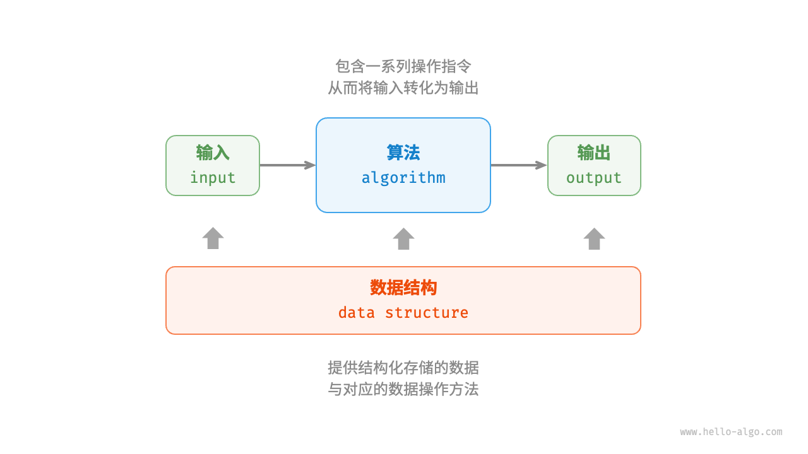
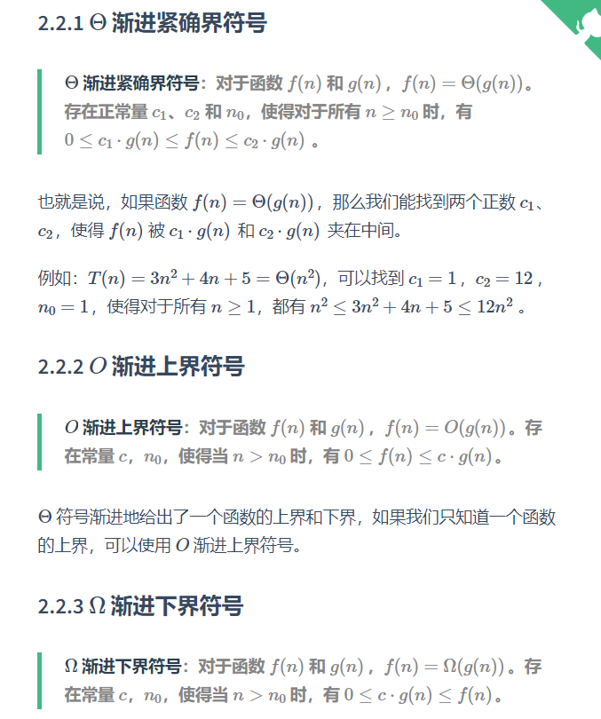
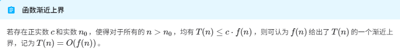
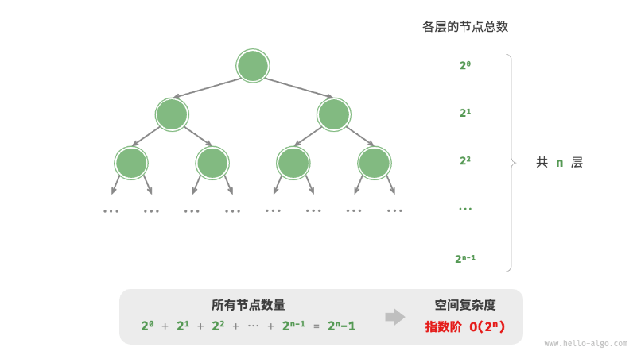

# 数据结构和算法简介

## 数据结构 （Data Structure）

数据结构（data structure）是计算机中组织和存储数据的方式。
数据结构包括数组、链表、栈、队列、哈希表、树、堆、图，它们可以从“逻辑结构”和“物理结构”两个维度进行分类。

### 逻辑结构：线性与非线性

- 线性数据结构：数组、链表、栈、队列、哈希表，元素之间是一对一的顺序关系。
- 非线性数据结构：树、堆、图、哈希表。

非线性数据结构可以进一步划分为树形结构和网状结构。

- 树形结构：树、堆、哈希表，元素之间是一对多的关系。
- 网状结构：图，元素之间是多对多的关系。

### 物理结构：连续与分散

1. 顺序存储结构（Sequential Storage Structure）：逻辑上相邻的数据元素在物理地址上也必然相邻
2. 链式存储结构（Linked Storage Structure）：逻辑上相邻的数据元素在物理地址上不一定相邻

所有数据结构都是*基于数组、链表或二者的组合*实现的。

## 算法（Algorithm）

算法（algorithm）是在有限时间内解决特定问题的一组指令或操作步骤.



## 算法复杂度

> 算法复杂度（Algorithm complexity）：在问题的输入规模为 n 的条件下，程序的时间使用情况和空间使用情况。

### 渐进符号





### 时间复杂度 T(n)

T(n)衡量基本操作次数，也就是程序每条语句执行的次数之和。
我们通常要借助渐进符号 O 来表示算法的时间复杂度。

#### 时间复杂度的计算：

找 T(n)中最高阶的项

1. 找出基本语句(执行最多的语句)
2. 计算基本语句执行次数的数量级
3. 放进大 O 里面

常见原则：

- 加法原则：总的时间复杂度等于量级最大的基本语句的时间复杂度
- 乘法原则：循环嵌套代码的复杂度等于嵌套内外基本语句的时间复杂度乘积。

对数阶：O(logn)
可以从结果倒推，比如 2^n=n，则 n=log2n。

线性对数阶：O(nlogn)
基本是 O(n)套 O(logn)或者相反。

阶乘阶：O(n!)
一般是递归

### 空间复杂度 S(n)

算法在运行过程中使用的内存空间主要包括以下几种。

- 输入空间：用于存储算法的输入数据。
- 暂存空间：用于存储算法在运行过程中的变量、对象、函数上下文等数据。
- 输出空间：用于存储算法的输出数据。

一般情况下，空间复杂度的统计范围是“暂存空间”加上“输出空间”。

暂存空间可以进一步划分为三个部分。

- 暂存数据：用于保存算法运行过程中的各种常量、变量、对象等。
- 栈帧空间：用于保存调用函数的上下文数据。系统在每次调用函数时都会在栈顶部创建一个栈帧，函数返回后，栈帧空间会被释放。
- 指令空间：用于保存编译后的程序指令，在实际统计中通常忽略不计。

在分析一段程序的空间复杂度时，我们通常**统计暂存数据、栈帧空间和输出数据**三部分

**我们通常只关注最差空间复杂度**

```python
def loop(n: int):
    """循环的空间复杂度为 O(1)"""
    for _ in range(n):
        function()

def recur(n: int):
    """递归的空间复杂度为 O(n)"""
    if n == 1:
        return
    return recur(n - 1)
```

函数 loop() 和 recur() 的时间复杂度都为 O(n)
，但空间复杂度不同。

函数 loop() 在循环中调用了 n 次 function() ，每轮中的 function() 都返回并释放了栈帧空间，因此空间复杂度仍为 O(1)
。
递归函数 recur() 在运行过程中会同时存在 n 个未返回的 recur() ，从而占用 O(n) 的栈帧空间。

线性阶：O(n)
常见于元素数量与 n 成正比的数组、链表、栈、队列等

平方阶：O(n^2)
平方阶常见于矩阵和图，元素数量与 n 成平方关系：

指数阶：O(2^n)


对数阶：O(logn)
对数阶常见于分治算法。(不懂)
